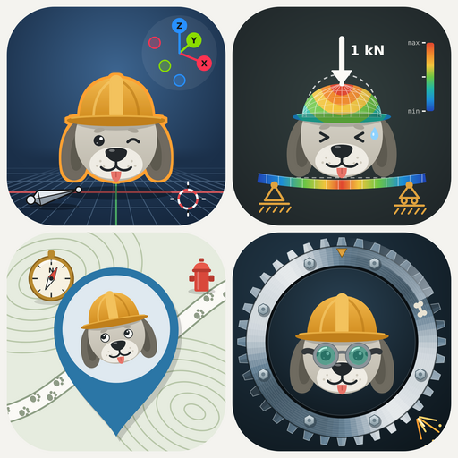

  

<h1 align="center">Strudog</h1>

Structural design, automated: from road alignment to a reinforced, buildable IFC model.

Strudog combines engineering rules, FEM analysis and AI to take a structure from the road it
serves to calculation reports and BIM models. We start with retaining walls and tunnel portals,
then move to bridges.
